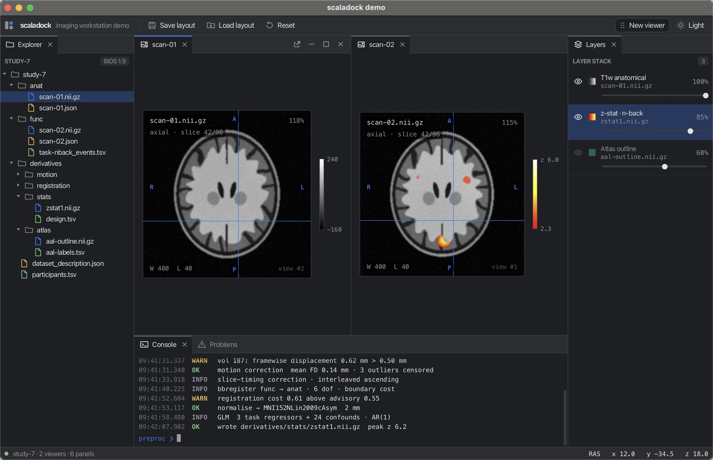
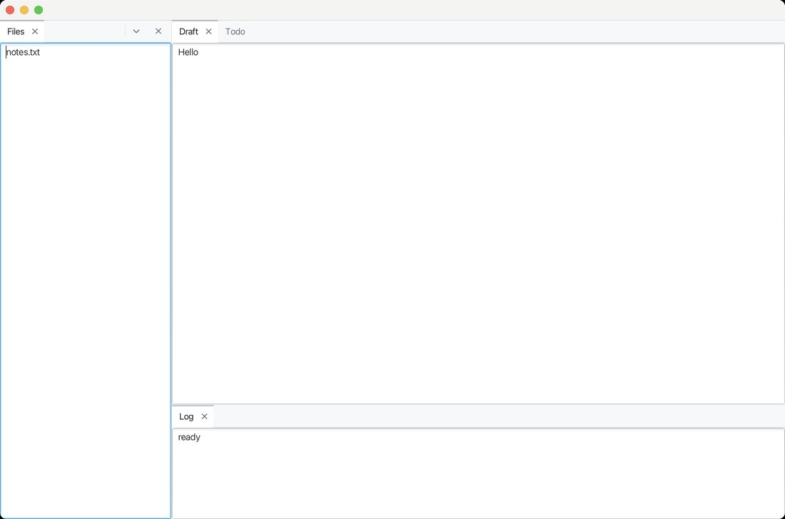
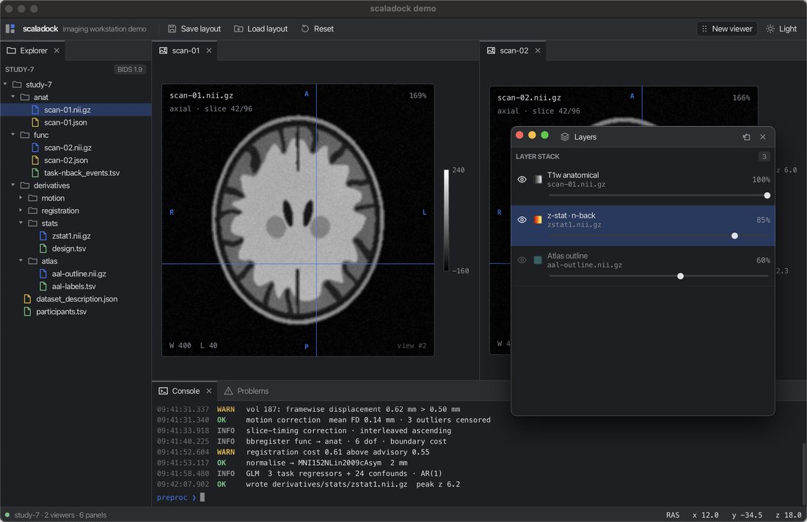
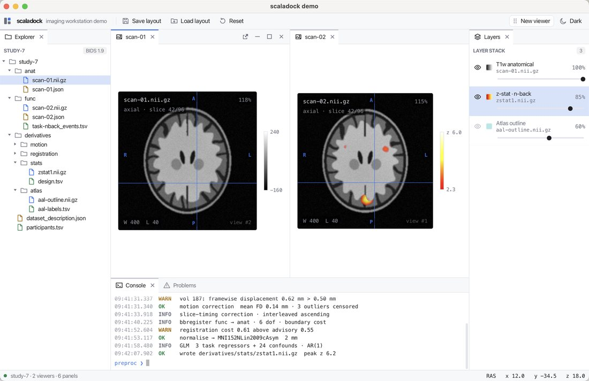

# scaladock

[Styling guide](docs/styling.md) · [Changelog](CHANGELOG.md) · [Demo source](modules/demo) · [CI](https://github.com/canardlapin/scaladock/actions)

scaladock is a docking-window framework for JavaFX, written in Scala 3. It gives a desktop app
IDE-style panels that users can arrange themselves: tabbed groups, resizable splits, drag-and-drop
rearrangement, floating windows, and whole workspaces that save and restore. Use it when you are
building a tool (an editor, a data or imaging workstation) whose users need to shape their own
layout.



<sub>A real capture of the bundled demo (`sbt demo/run`).</sub>

> **Status:** pre-release (`0.1.0-SNAPSHOT`) and source-only — not yet on Maven Central. APIs,
> semantics, and package boundaries may change; no stable support or binary-compatibility promise
> applies yet. Behaviour changes are recorded in the [changelog](CHANGELOG.md).

## Quick start

A dockable app is three things you write: the **state** each pane saves, a **view** that shows
it, and a **layout**. This complete program opens the window below:

```scala
import javafx.application.Platform
import javafx.scene.Scene
import javafx.scene.control.TextArea
import javafx.stage.Stage
import scaladock.*
import scaladock.dsl.*
import scaladock.fx.*
import upickle.default.ReadWriter

// 1. The state a pane saves and restores
case class Note(text: String) derives ReadWriter
val NoteType = PaneType[Note]("app.note")

// 2. The pane's view: any JavaFX node, plus how to snapshot its state
class NoteView(start: Note) extends PaneView[Note]:
  private val area = TextArea(start.text)
  def node         = area
  def snapshot()   = Note(area.getText)

@main def hello(): Unit = Platform.startup: () =>
  val factories = PaneFactories.empty.register(NoteType)(s => NoteView(s))

  // 3. The layout, written as a picture of itself
  val layout = LayoutState.of(
    row(
      NoteType(Note("notes.txt")).titled("Files") sized 240.px,
      column(
        group(NoteType(Note("Hello")).titled("Draft"), NoteType(Note("Todo")).titled("Todo")),
        NoteType(Note("ready")).titled("Log") sized 160.px
      )
    )
  )

  // 4. One Dock, dropped into any scene
  val dock = Dock(factories, initial = layout)
  dock.setTheme(DockTheme.Light) // matches JavaFX's default (light) controls
  val stage = Stage()
  stage.setScene(Scene(dock.view, 1100, 700))
  stage.show()
```



From here the user can drag any tab onto another group's header (to join it) or onto an edge (to
split beside it), pull a group into its own window, drag dividers, and minimise or maximise
groups. Save the whole arrangement — floating windows included — with `dock.save()` (JSON) and
restore it with `dock.load(json)`.

This exact program is compiled with the demo
([`QuickStart.scala`](modules/demo/src/main/scala/scaladock/demo/readme/QuickStart.scala)); run it
with `sbt "demo/runMain scaladock.demo.readme.hello"`.

### Using it from your project

Until the first release, build from source and publish locally:

```sh
git clone https://github.com/canardlapin/scaladock && cd scaladock
sbt publishLocal
```

```scala
// build.sbt — scaladock-fx pulls in scaladock-core
libraryDependencies += "io.github.bbuchsbaum" %% "scaladock-fx" % "0.1.0-SNAPSHOT"
// scaladock-fx declares JavaFX as "provided": add JavaFX for your platform, e.g.
libraryDependencies ++= Seq("base", "graphics", "controls").map(m =>
  "org.openjfx" % s"javafx-$m" % "24.0.1" classifier "mac-aarch64" // or linux, win, mac, …
)
```

Requires Scala 3.7+, JDK 22+, and JavaFX 24+ (the demo itself runs on JavaFX 27 / JDK 25).

## What it covers

<table>
<tr>
<td width="50%"></td>
<td width="50%"></td>
</tr>
<tr>
<td><sub>Dragging a tab: the drop target previews exactly where it will land.</sub></td>
<td><sub>A group popped out into its own window, with a themed title bar.</sub></td>
</tr>
</table>

- **Rearrange by drag and drop** — reorder tabs, split beside any group, dock at a window edge,
  or tear a group into a floating window and back. The preview shows the exact landing spot, the
  layout doesn't change until you let go, and Esc cancels.
- **Save and restore workspaces** — the whole layout, floating windows included, round-trips
  through JSON, with each pane's state typed end to end. Unknown pane types are kept, not dropped.
- **Panes are never rebuilt** — a pane's JavaFX node is created once and only moved, so a viewer
  keeps its scroll position, selection, and GPU resources through tab switches, splits, drags,
  and pop-outs.
- **Everyday states** — minimise to a side rail or strip, maximise one group, overflowing tabs,
  an empty-window placeholder, and close vetoes for unsaved work
  ([close admission](docs/close-admission.md)).
- **Theme with CSS** — dark and light built in; a theme redefines a handful of variables, and
  every icon is replaceable ([styling guide](docs/styling.md)).
- **Test your layout logic without a UI** — the layout model (`scaladock-core`) is plain,
  immutable Scala with no JavaFX dependency.



## Fit and boundaries

A good fit for JavaFX desktop apps that want VS Code- or JetBrains-style panel layouts from
Scala 3. Not covered yet: keyboard navigation between groups (F6), tab context menus, and keeping
panes alive across a full `load` of a different layout — all on the roadmap. The library is
tested in CI on Linux and macOS with JDK 25, and on Linux with JDK 22 and JavaFX 24 (the library's floor); Windows is untested.
scaladock takes golden-layout's model as its conceptual starting point
([golden-layout](https://github.com/golden-layout/golden-layout)).

## How it works

The layout is one immutable value, `LayoutState`: a tree of splits and tab groups whose leaves
are panes carrying typed state. Every gesture — a drop, a divider drag, a close, a pop-out — is a
pure function `LayoutState => LayoutState` (in `scaladock.edit`), property-tested so that, for
example, a drop can never lose a pane. The JavaFX layer holds the one mutable reference: it
applies each transition, updates long-lived views keyed by stable ids (which is why pane nodes
are never rebuilt), and publishes typed `DockEvent`s. Floating windows are just more data in the
same value, which is why multi-window layouts save like everything else.

| Artifact | What it is |
|---|---|
| `scaladock-fx` | The JavaFX dock: rendering, drag and drop, floating windows, theming. Depend on this. |
| `scaladock-core` | The JavaFX-free layout model, transitions, sizing, JSON codec, and DSL (depends only on uPickle). |

## Documentation

- [Styling and theming](docs/styling.md) — CSS variables, style classes, and icons
- [Close admission](docs/close-admission.md) — letting panes save, veto, or defer a close
- [Changelog](CHANGELOG.md) — behaviour changes to check when updating a pinned version
- [The demo](modules/demo) — a full imaging-workstation example, and the screenshot rig
  (`Shots.scala`) that captures the real app for visual review
- [Manual release checks](docs/manual-checks.md) · [SemanticDB output](docs/semanticdb-output.md)

## Development

```sh
sbt test            # core: property tests; fx: JavaFX toolkit tests (needs a display, or xvfb)
sbt demo/run        # the imaging demo
sbt scalafmtAll     # format
```

## License

[Apache-2.0](LICENSE)
